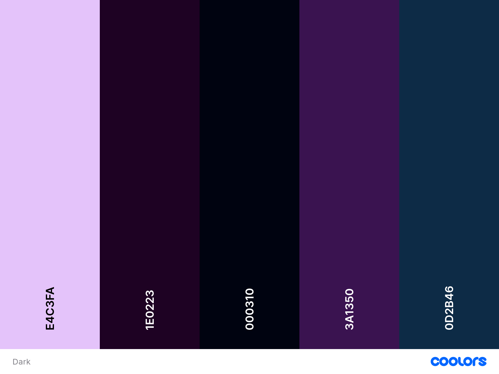
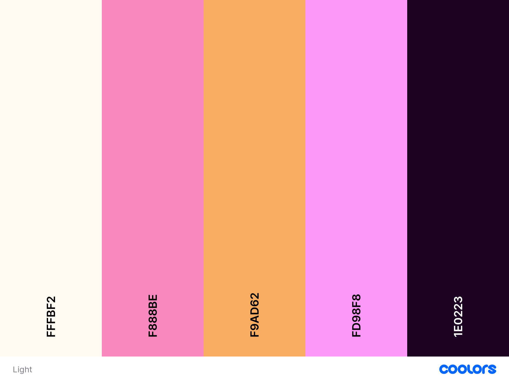

# Development Notes

## Broad Plan:
---------------
#### Plan out features to work On - <b>Completed</b>
#### Plan out design and layout - <b>In Progress</b>
#### Start work on some of the basic css - <b>Not Started</b>
#### Include any libraries and write boilerplate Html - <b>Not Started</b>
#### Start writing the css and html content - <b>Not Started</b>
#### Write the scripts I need - <b>Not Started</b>
#### Connect the scripts to the content - <b>Not Started</b>
#### Connect the scripts to the server - <b>Not Started</b>
#### Move to x10Hosting - <b>Not Started</b>
#### Continue Development - <b>Not Started</b>

## Pages & Features: 
-----------------

### MainPage

- Section1
    - Icon
    - Gradient
    - Search through roblox gears + Button to gear list
- Section2
    - Features
        - Description
        - ScriptSearcher
    - Coming Soon
- Section3
    - About paragraph
    - Socials
    - Special Thanks

### GearsList
    
- Title
    - Link to MainPage
- ItemContainer
    - Searchbar
        - Filter
    - GearCards
        - GearName
        - Thumbnail
            - Limited / LimitedU
        - Description
        - InfoButton
        - Price / OffSale
        - Favorite Count
- Footer
    - ScriptSearcher

### GearPage

- Navbar
    - HomePage 
    - GearSearch
    - ScriptSearch 
- MainContent
    - GearName
    - Thumbnail
        - Limited / LimitedU
    - Description
    - Price / OffSale
    - Favorite Count
    - Script Count
- ScriptViewContainer
    - Search
        - Filter
    - ScriptBlock
        - Highlighting
        - Copy
        - Expand
- Footer
    - ScriptSearcher

## Color Themes
------------------------

## Layouts
-----------------------
